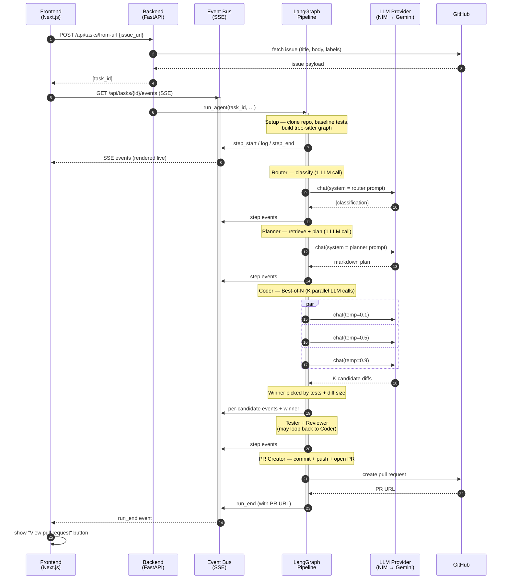
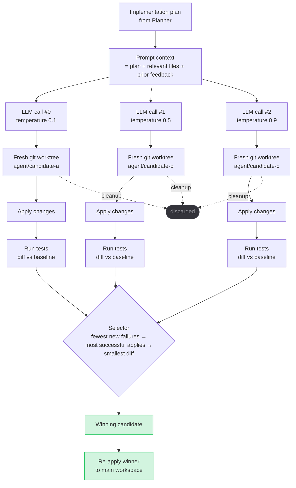

# Vegapunk — Autonomous Coding Agent

[](https://github.com/OWNER/REPO/actions/workflows/ci.yml)
[](https://www.python.org/downloads/)
[](https://nodejs.org/)
[](#license)

**Give it a GitHub issue URL. Get a pull request.**

Vegapunk is an autonomous coding agent that resolves GitHub issues end-to-end. It clones the repo, classifies the issue, plans the implementation, writes the code, runs the tests, self-reviews the diff, and opens the PR — with a live trace UI so you can watch every step.

- **Tree-sitter code intelligence** replaces regex retrieval — grounded in research reporting ~10x token reduction on real repos
- **Best-of-N Coder** generates K parallel candidate diffs in isolated git worktrees, keeps the one that passes tests
- **68 unit + integration tests, 60% coverage, CI on every push**
- **Free-tier deployable** — Vercel (frontend) + Render (backend), plus a self-host docker-compose
- **Demo mode** — pre-recorded transcript replays a full run without API keys, perfect for portfolio review

> Replace `OWNER/REPO` in the badge URLs above with your GitHub path after your first push.

---

## Try it live

- **Deployed demo:** _add your Vercel URL here after first deploy_
- Or **run locally** in two commands (see [Quickstart](#quickstart-local) below)
- No API keys? Click **Try demo** in the UI to replay a pre-recorded run

---

## Architecture

Vegapunk is a **FastAPI backend + Next.js frontend**. The backend hosts a LangGraph pipeline that emits typed events over Server-Sent Events; the frontend renders them as a live trace.

Rather than one sprawling diagram, here are three focused views — each answers one question.

### 1. What happens when you click "Run agent"

The high-level request timeline from click to PR link, across every process boundary.



### 2. Best-of-N Coder — the quality-lifting mechanic

Instead of trusting a single LLM sample, the Coder generates **K parallel candidates** at different temperatures, verifies each against real tests in an isolated git worktree, and keeps the winner. Rooted in the DeepSWE / ACECoder line of research on execution-verified rewards.



`K` is configurable via `CODER_BON_K` (default 3; set to 1 to disable and use the fast path).

### 3. Repo graph — the retrieval mechanic

Before the Planner writes anything, we build a **tree-sitter graph** of the workspace and rank files by a hybrid of keyword overlap and PageRank. Grounded in a 2026 study reporting ~10× token reduction over regex scans on real repos.

```mermaid
flowchart LR
    Files[(Workspace<br/>.py / .ts / .js / .go / .rs)] --> TS[tree-sitter parse<br/>per file, per language]

    TS --> Sym[Symbols<br/>funcs / classes / methods]
    TS --> Ref[References<br/>calls / imports]

    Sym --> Idx[Symbol index<br/>name → Symbol&#91;&#93;]
    Ref --> Idx

    Sym --> FG[File reference graph<br/>edge a→b: a uses<br/>a symbol defined in b]
    Ref --> FG
    FG --> PR[NetworkX PageRank<br/>α = 0.85]

    Query[User query<br/>issue title + body] --> Tok[Tokenize<br/>drop stop-words]
    Tok --> Rank
    Idx --> Rank
    PR --> Rank

    Rank[Hybrid ranking<br/>0.7 · keyword + 0.3 · pagerank] --> Top[Top-15 relevant files]
    Top --> Planner[Planner LLM prompt]

    style Rank fill:#4f8cff33,stroke:#4f8cff
    style Top fill:#22c55e33,stroke:#22c55e
```



For a **code-level walkthrough** with file:line references, see [`docs/WALKTHROUGH.md`](docs/WALKTHROUGH.md). For vocabulary, [`docs/GLOSSARY.md`](docs/GLOSSARY.md).

---

## Pipeline

| # | Step | Responsibility |
|---|------|----------------|
| 1 | **Setup** | Clone repo, create working branch, capture baseline test failures, build the tree-sitter repo graph |
| 2 | **Router** | Classify the issue as one of `bug_fix / feature / refactor / docs / test / chore` |
| 3 | **Planner** | Rank relevant files via the repo graph, produce a markdown implementation plan |
| 4 | **Coder** | Generate K candidate diffs in parallel (Best-of-N), evaluate each in an isolated git worktree, keep the one with fewest new test failures |
| 5 | **Tester** | Run tests on main workspace; only failures **new** vs the baseline trigger a retry back to Coder |
| 6 | **Reviewer** | Self-review the diff for correctness, quality, and security; revise via Coder if needed (bounded) |
| 7 | **PR Creator** | Commit, push, detect the repo's default branch, open the PR, comment on the source issue |

Both retry loops (Tester → Coder, Reviewer → Coder) cap at `max_retries` (default 3) so nothing can spin forever.

---

## Quickstart (local)

**Prerequisites:** Python 3.11+, Node.js 18+, one LLM API key (NVIDIA NIM or Gemini), a GitHub PAT with `repo` scope.

```bash
# 1. Clone + set up
git clone https://github.com/OWNER/REPO.git vegapunk
cd vegapunk
python -m venv .venv && source .venv/bin/activate
make install
cp .env.example .env   # then edit with your API keys

# 2. Run backend and frontend in two terminals
make dev-api           # terminal 1: uvicorn on :8000
make dev-web           # terminal 2: next dev on :3000
```

Open <http://localhost:3000>. Paste a GitHub issue URL. Hit **Run agent** — or **Try demo** if you don't want to burn API credits yet.

Or run everything under Docker:

```bash
make demo   # docker compose up --build
```

---

## Deploy (free tier)

Vegapunk is designed for free-tier hosting so anyone can spin up their own instance.

### Frontend → Vercel

Vercel auto-detects Next.js. On import:
- **Root directory:** `frontend`
- **Env vars:** `NEXT_PUBLIC_API_URL` = your Render backend URL

### Backend → Render

A [`render.yaml`](render.yaml) blueprint provisions a free Python web service. On first deploy, set these env vars in the Render dashboard:

| Variable | Notes |
|---|---|
| `NVIDIA_API_KEY` | one of these two is required for real runs |
| `GEMINI_API_KEY` | one of these two is required for real runs |
| `GITHUB_TOKEN` | required for real runs; demo mode works without |
| `APP_ENV` | set to `production` |

**Caveat:** Render's free tier auto-sleeps after 15 minutes of inactivity. First request after sleep takes ~30 seconds cold start. Demo mode still works after wake.

### Self-host

```bash
docker compose up --build   # backend + frontend in one stack
```

---

## Demo mode

Click **Try demo** in the UI — or `curl -X POST http://localhost:8000/api/tasks/demo`.

Instead of calling the LLM, the backend replays [`demo/transcript.json`](demo/transcript.json) into the same SSE stream that real runs use. The trace UI can't tell the difference. No credentials, no quota burn, ~17 seconds end-to-end.

Edit the transcript to change what reviewers see.

---

## Use Vegapunk from your IDE (MCP)

Vegapunk ships an MCP server that exposes the internal tools plus the tree-sitter repo graph over the [Model Context Protocol](https://modelcontextprotocol.io). Any MCP-capable client can drive it — Claude Code, Cursor, Cline, Continue.dev, Windsurf, Codex CLI, and the ~9k other servers in the ecosystem.

Two-line setup for Claude Code (`~/.config/claude/mcp.json`):

```json
{
  "mcpServers": {
    "vegapunk": {
      "command": "vegapunk-mcp",
      "env": { "VEGAPUNK_WORKSPACE": "/absolute/path/to/your/project" }
    }
  }
}
```

Then ask your IDE things like *"which files reference `hash_password`?"* or *"rank files by relevance to `user login`."* The IDE hits `vegapunk://graph/references/hash_password` or `vegapunk://graph/relevant?q=user%20login` over MCP and gets structured JSON back.

**The novel bit:** most MCP servers expose only tools (procedural verbs). Vegapunk exposes the repo graph as **first-class URI-addressable resources** so clients can subscribe, cite, and cache graph slices without invoking a tool every time. Same measured 10× token / 2× tool-call reduction the 2026 Codebase-Memory study reported.

Full setup — including Cursor and Cline configs — in [`mcp_server/README.md`](mcp_server/README.md).

---

## Features

### Tree-sitter repo graph — [`tools/repo_graph.py`](tools/repo_graph.py)

Language-agnostic code index for Python, TypeScript, JavaScript, Go, and Rust. Extracts function / class / method definitions and calls / imports. Builds a file-level directed graph where edge `(a, b)` means "a references a symbol defined in b". Retrieval ranks by a hybrid of query-keyword overlap and PageRank on the reference graph.

Why hybrid? Aider's repomap uses pure PageRank on symbol graphs and buries files that match rare query terms. Legacy Vegapunk used pure regex keyword and missed transitively-related files. `alpha * keyword + (1-alpha) * pagerank` (default α=0.7) gets both signals.

Grounded in the [2026 Codebase-Memory study](https://anthonywest.co.uk/research/code-intelligence-indexing-2026-openai) reporting **~10x fewer tokens and ~2x fewer tool calls** vs regex retrieval on real repos. **90% test coverage** in [`tests/test_repo_graph.py`](tests/test_repo_graph.py).

### Best-of-N Coder — [`agent/nodes/coder.py`](agent/nodes/coder.py) + [`tools/best_of_n.py`](tools/best_of_n.py)

Generates K candidate diffs in parallel at varied temperatures (default `[0.1, 0.5, 0.9]`). Each candidate applies to its own git worktree (via `git worktree add -b`) and runs the project's test suite independently. Winner is chosen by execution-verified criteria: fewest new test failures → most successful applies → smallest diff.

Grounded in the [DeepSWE](https://www.together.ai/blog/deepswe) and [ACECoder](https://arxiv.org/pdf/2502.01718) line of work on execution-verified rewards. **100% test coverage** on the selector; end-to-end integration tests exercise real git worktrees with mocked LLM.

Config knobs (in `.env`):
- `CODER_BON_K` — default 3; set to 1 to disable and get the fast path
- `CODER_BON_TEMPERATURES_CSV` — comma-separated temperatures
- `CODER_BON_MAX_PARALLEL` — bounded concurrency
- `CODER_BON_TIMEOUT_SECONDS` — per-candidate timeout

### Trace-style live UI — [`frontend/src/app/page.tsx`](frontend/src/app/page.tsx)

The frontend consumes the backend's SSE stream and renders each pipeline step as a card with a live status dot, a duration, and collapsible logs. Inspired by LangSmith trace views. No animations that hide latency — you see exactly what the agent is doing when.

### Baseline test comparison

Before Coder touches anything, Setup snapshots the repo's existing test failures. When Tester runs post-change, only failures **not** in the baseline count as a regression. Pre-existing bugs don't get blamed on the agent.

### Reviewer / Coder revision loop with a cap

Reviewer can send a diff back to Coder for revisions. Historically this loop had no bound. It now caps at `max_retries` and force-approves with a warning event if reached — the pipeline can't spin forever.

---

## Benchmarks

Full detail in [`docs/benchmarks.md`](docs/benchmarks.md). Highlights:

| Metric | Before overhaul | After Phase 2 |
|---|---|---|
| Passing tests | 10 (1 broken) | **68** |
| Coverage | 41% | **60%** |
| Ruff errors | 62 | **0** |
| Emojis in source | many | **0 (grep-verified)** |
| `tools/repo_graph.py` coverage | n/a (didn't exist) | **90%** |
| `tools/best_of_n.py` coverage | n/a (didn't exist) | **100%** |

Real-repo A/B measurement of repo-graph vs regex retrieval is a documented follow-up.

---

## Project layout

```
vegapunk/
  agent/
    graph.py                # LangGraph pipeline + setup_node
    state.py                # AgentState TypedDict
    nodes/                  # router / planner / coder / tester / reviewer / pr_creator
  app/
    main.py                 # FastAPI entry
    config.py               # Pydantic settings
    events.py               # In-memory event bus, typed step events
    api/
      tasks.py              # REST + SSE endpoints (incl. /demo)
      webhooks.py           # GitHub webhook handler
  llm/
    provider.py             # NIM -> Gemini fallback, ModelTier
    nvidia_nim.py
    gemini.py
  tools/
    repo_graph.py           # tree-sitter code intelligence
    best_of_n.py            # Best-of-N selector + failure extraction
    git_ops.py              # clone / branch / commit / push / worktree
    github_api.py
    filesystem.py
    test_runner.py
    code_search.py          # legacy retrieval (fallback)
    sandbox.py              # Docker sandbox with local fallback
  frontend/
    src/
      app/                  # page.tsx, layout.tsx, globals.css
      components/           # task-form / run-header / step-card
      lib/types.ts          # shared types + STEP_DEFS
  tests/
    fixtures/mini_py/       # small repo used for repo-graph tests
    test_repo_graph.py      # 31 tests
    test_worktree.py        # 8 tests
    test_best_of_n_selector.py       # 12 tests
    test_best_of_n_integration.py    # 6 tests
    test_demo_endpoint.py            # 3 tests
    test_api.py test_tools.py         # existing suite
    conftest.py             # autouse fixture that scrubs ambient .env
  demo/
    transcript.json         # pre-recorded events for /api/tasks/demo
  docs/
    benchmarks.md
  .github/workflows/ci.yml  # matrix on 3.11 + 3.12, backend + frontend jobs
  Makefile                  # one-command entry points
  docker-compose.yml
  render.yaml               # free-tier backend blueprint
```

---

## Tech stack

**Backend**
- FastAPI (async, CORS, Server-Sent Events)
- LangGraph — `StateGraph` with conditional edges for retry loops
- LLM providers: NVIDIA NIM (Qwen / Nemotron) primary, Google Gemini fallback (auto-failover)
- Tree-sitter (py / ts / js / go / rs) + NetworkX + SciPy for the repo graph
- GitPython + PyGithub
- Docker sandbox with local-execution fallback for development

**Frontend**
- Next.js 16 (App Router, React 19)
- Tailwind CSS
- Native `EventSource` API for SSE (no framework wrapper)

**Dev tooling**
- ruff, mypy, pytest + pytest-cov + pytest-asyncio + respx (HTTP mocking)
- eslint, tsc
- GitHub Actions matrix on Python 3.11 + 3.12

---

## Known limitations and follow-ups

Ranked roughly by impact:

1. **Task and event persistence** — task list and event bus history live in memory today; they vanish on server restart. `aiosqlite` is already declared in `pyproject.toml` for this migration.
2. **Sandbox network isolation** — `SANDBOX_ALLOW_NETWORK` (default `true`) lets cloned projects `pip install`; hardened deploys should use egress-only firewall rules instead.
3. **No repo-size guard** — a large repo will make Setup chew disk. Shallow clone (`--depth 1`) plus a byte-size cap is a small, high-value addition.
4. **Real-repo A/B benchmark of the repo graph** — regression guard against silent PageRank degradation is in place, but a measured comparison against legacy regex retrieval on real GitHub issues hasn't been published.
5. **LSP integration** — tree-sitter gives us the token-reduction win; LSP is a v2 upgrade for cross-file "find all references" precision.
6. **API auth** — anyone reachable at the backend URL can trigger runs (spends LLM credits, pushes commits under your GitHub token).
7. **Token / cost metrics per step** — the trace UI shows durations; the LLM provider layer doesn't yet thread usage counts back into the event bus.
8. **MCP tool plane** (deferred) — expose the internal tools + repo graph as MCP resources so Claude Code / Cursor / Cline can drive Vegapunk directly. Design sketch in the commit history.

---

## License

MIT
