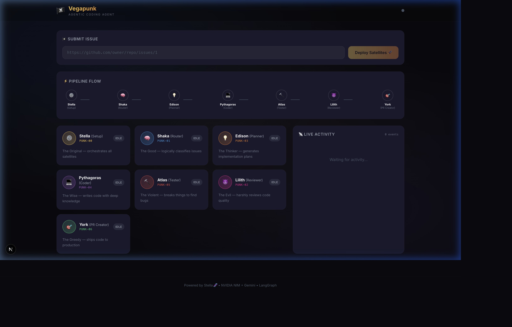
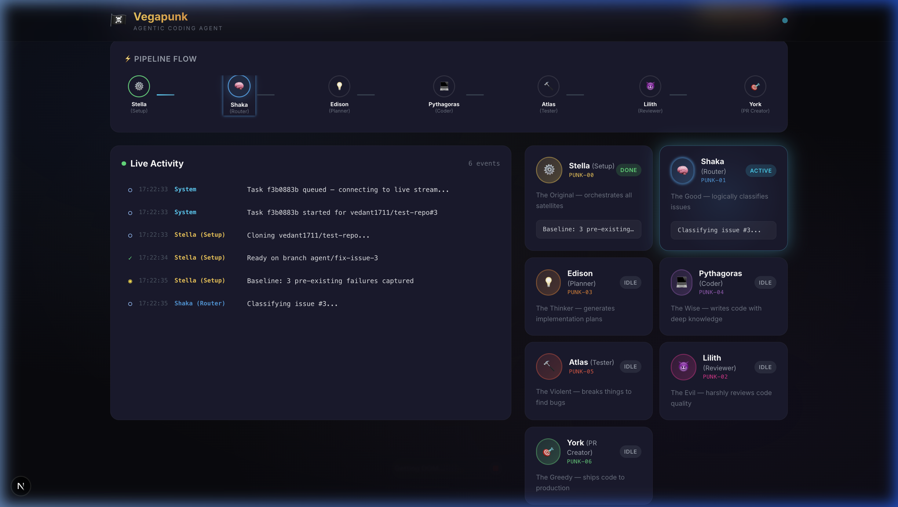
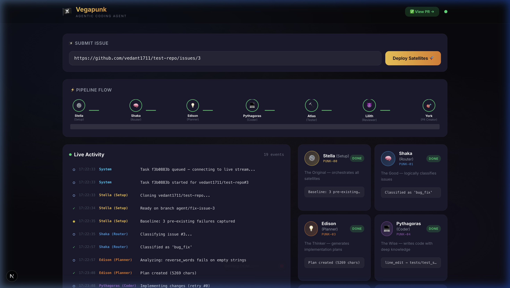

# 🏴‍☠️ Vegapunk — Autonomous AI Coding Agent

> *"A man's dream will never die!"* — Dr. Vegapunk would agree, especially about autonomous coding.

**Vegapunk** is a fully autonomous AI coding agent that resolves GitHub issues end-to-end — analyzing code, planning fixes, writing changes, running tests, reviewing quality, and creating pull requests. Powered by **7 Satellite Agents** inspired by One Piece's Dr. Vegapunk, with a real-time visualization dashboard.

---

## 🎬 Demo

<p align="center">
  
</p>

> ☝️ Watch Vegapunk solve a real GitHub issue in ~60 seconds — from issue classification to PR creation, with all 7 satellites working in sequence.

---

## 📸 Dashboard UI

### Idle State — Dashboard Ready
<p align="center">
  
</p>

### Active Processing — Satellites at Work
<p align="center">
  
</p>

> Shaka (Router) glows **cyan** as it classifies the issue. Stella is already **done** (green). The Live Activity panel shows events streaming in real-time.

### Completed — PR Created
<p align="center">
  
</p>

> All 7 satellites show **DONE** with green badges. The **"✅ View PR →"** button appears in the header. 19 events logged in the live activity feed.

---

## 🧬 The Seven Satellites

Each agent node maps to one of Dr. Vegapunk's satellite bodies from One Piece:

| # | Satellite | Role | Personality | What It Does |
|---|---|---|---|---|
| 00 | ⚙️ **Stella** | Setup | The Original | Clones repos, creates branches, captures baseline test state |
| 01 | 🧠 **Shaka** | Router | The Good | Classifies issues — `bug_fix`, `feature`, `refactor`, `docs`, `test` |
| 03 | 💡 **Edison** | Planner | The Thinker | Analyzes codebase structure and generates implementation plans |
| 04 | 💻 **Pythagoras** | Coder | The Wise | Writes code using a hybrid file/line-edit strategy |
| 05 | 🔨 **Atlas** | Tester | The Violent | Runs tests with baseline comparison — ignores pre-existing failures |
| 02 | 😈 **Lilith** | Reviewer | The Evil | Self-reviews diffs for correctness, security, and code quality |
| 06 | 🎯 **York** | PR Creator | The Greedy | Commits, pushes, and creates pull requests on GitHub |

---

## 🏗️ Architecture

### High-Level Overview

```
┌──────────────────────────────────────────────────────────────────┐
│                        Frontend (Next.js :3000)                  │
│  ┌─────────┐  ┌──────────────┐  ┌────────────┐  ┌───────────┐  │
│  │Task Form│  │Pipeline Flow │  │ Agent Cards │  │Log Stream │  │
│  │(Submit) │  │(7-node chain)│  │(7 satellites│  │(SSE live) │  │
│  └────┬────┘  └──────────────┘  └────────────┘  └─────▲─────┘  │
│       │                                                │        │
└───────┼────────────────────────────────────────────────┼────────┘
        │ POST /api/tasks/from-url                       │ GET /api/tasks/{id}/events (SSE)
        ▼                                                │
┌───────────────────────────────────────────────────────────────────┐
│                      Backend (FastAPI :8000)                       │
│                                                                   │
│  ┌───────────┐    ┌──────────────────────────────────────────┐   │
│  │ Tasks API │───▶│           LangGraph Pipeline             │   │
│  │ (REST+SSE)│    │                                          │   │
│  └───────────┘    │  Stella → Shaka → Edison → Pythagoras    │   │
│                   │                      │                   │   │
│  ┌───────────┐    │             Atlas ◄──┘                   │   │
│  │ Event Bus │◄───│               │                          │   │
│  │ (in-mem)  │    │           Lilith → York → PR ✅          │   │
│  └───────────┘    └──────────────────────────────────────────┘   │
│                                                                   │
│  ┌─────────────────────────────────────────────────────────────┐ │
│  │                       Tools Layer                           │ │
│  │  git_ops │ github_api │ filesystem │ test_runner │ sandbox  │ │
│  └─────────────────────────────────────────────────────────────┘ │
│                                                                   │
│  ┌─────────────────────────────────────────────────────────────┐ │
│  │                      LLM Provider                           │ │
│  │             NVIDIA NIM (primary) │ Gemini (fallback)        │ │
│  └─────────────────────────────────────────────────────────────┘ │
└───────────────────────────────────────────────────────────────────┘
```

### Pipeline Flow

```
Issue URL submitted
        │
        ▼
   ┌─────────┐
   │  Stella  │  Clone repo, create branch, run baseline tests
   │ (Setup)  │  Captures pre-existing test failures
   └────┬─────┘
        ▼
   ┌─────────┐
   │  Shaka   │  Classify issue type using LLM
   │ (Router) │  Output: bug_fix | feature | refactor | docs | test
   └────┬─────┘
        ▼
   ┌─────────┐
   │  Edison  │  Analyze codebase structure (file tree, relevant files)
   │(Planner) │  Generate detailed implementation plan via LLM
   └────┬─────┘
        ▼
   ┌──────────┐
   │Pythagoras│  Read relevant source files with line numbers
   │ (Coder)  │  Generate code changes via LLM — uses line_edit for precision
   └────┬─────┘  Supports up to 3 retries on failure
        │
        ▼
   ┌─────────┐
   │  Atlas   │  Run linter (if configured) + pytest
   │ (Tester) │  Compare failures against baseline — ignore pre-existing bugs
   └────┬─────┘  If NEW failures → retry loop back to Pythagoras
        │
        ▼
   ┌─────────┐
   │  Lilith  │  Self-review: analyze diff for correctness & security
   │(Reviewer)│  If rejected → retry loop back to Pythagoras
   └────┬─────┘
        │
        ▼
   ┌─────────┐
   │  York    │  git commit → git push → create GitHub PR
   │(PR Maker)│  Posts comment on original issue with link to PR
   └─────────┘
        │
        ▼
   ✅ Pull Request Created
```

### Retry Logic

Vegapunk includes intelligent retry loops:

```
Pythagoras (Coder) ──▶ Atlas (Tester) ──▶ Lilith (Reviewer) ──▶ York (PR)
       ▲                     │                    │
       │      test failure   │    review reject   │
       └─────────────────────┘────────────────────┘
                     (max 3 retries)
```

If Atlas detects **new** test failures or Lilith rejects the code, the pipeline loops back to Pythagoras with the error context, allowing the agent to self-correct.

---

### Real-Time Event System

Vegapunk uses **Server-Sent Events (SSE)** for real-time frontend updates:

```
Backend Nodes            Event Bus              Frontend
┌──────────┐         ┌──────────────┐        ┌──────────────┐
│ Shaka    │──emit──▶│              │──SSE──▶│ EventSource  │
│ Edison   │──emit──▶│  event_bus   │        │   ▼          │
│ Pythagoras──emit──▶│  (in-memory) │        │ Log Stream   │
│ Atlas    │──emit──▶│              │        │ Agent Cards  │
│ Lilith   │──emit──▶│  subscribe() │        │ Pipeline Flow│
│ York     │──emit──▶│              │        └──────────────┘
└──────────┘         └──────────────┘
```

**Endpoint:** `GET /api/tasks/{task_id}/events`  
**Format:** JSON events streamed via SSE  
**Features:** Event history replay for late-connecting clients, automatic keepalive, graceful completion detection.

---

## 📁 Project Structure

```
vegapunk/
├── agent/                    # LangGraph agent pipeline
│   ├── graph.py              # Main workflow — compiles & runs the pipeline
│   ├── state.py              # AgentState TypedDict — shared state across nodes
│   └── nodes/
│       ├── router.py         # 🧠 Shaka — issue classification
│       ├── planner.py        # 💡 Edison — implementation planning
│       ├── coder.py          # 💻 Pythagoras — code generation
│       ├── tester.py         # 🔨 Atlas — test execution & baseline comparison
│       ├── reviewer.py       # 😈 Lilith — self-review
│       └── pr_creator.py     # 🎯 York — git push & PR creation
│
├── app/                      # FastAPI backend
│   ├── main.py               # App entry point, CORS, lifespan
│   ├── config.py             # Settings from environment variables
│   ├── events.py             # Event bus for SSE streaming
│   └── api/
│       ├── tasks.py          # REST + SSE endpoints for tasks
│       └── webhooks.py       # GitHub webhook handler
│
├── llm/                      # LLM provider abstraction
│   ├── provider.py           # Unified interface with model tiers
│   ├── nvidia_nim.py         # NVIDIA NIM API client
│   └── gemini.py             # Google Gemini API client
│
├── tools/                    # External tool integrations
│   ├── git_ops.py            # Clone, branch, commit, push via GitPython
│   ├── github_api.py         # GitHub API via PyGithub (issues, PRs, comments)
│   ├── filesystem.py         # Read/write files, line-edit operations
│   ├── test_runner.py        # pytest runner + linter detection
│   ├── code_search.py        # File structure analysis & relevant file search
│   └── sandbox.py            # Docker sandbox for safe command execution
│
├── frontend/                 # Next.js real-time dashboard
│   ├── src/
│   │   ├── app/
│   │   │   ├── page.tsx      # Main dashboard — SSE consumer
│   │   │   ├── layout.tsx    # Root layout with Inter font
│   │   │   └── globals.css   # Dark One Piece theme
│   │   ├── components/
│   │   │   ├── agent-card.tsx    # Satellite agent card with glow animations
│   │   │   ├── pipeline-flow.tsx # Pipeline node chain visualization
│   │   │   ├── log-stream.tsx    # Real-time log viewer (monospace, colored)
│   │   │   └── task-form.tsx     # Issue URL input + submit button
│   │   └── lib/
│   │       └── types.ts      # Satellite definitions, types, log mapping
│   └── package.json
│
├── docs/images/              # Screenshots & demo recordings
├── pyproject.toml            # Python project config & dependencies
├── Dockerfile                # Backend container
├── docker-compose.yml        # Multi-service deployment
└── .env.example              # Environment variable template
```

---

## 🚀 Quick Start

### Prerequisites
- Python 3.11+
- Node.js 18+ (for frontend)
- At least one LLM API key (NVIDIA NIM or Google Gemini)
- GitHub Personal Access Token

### 1. Backend Setup

```bash
# Clone the repository
git clone <your-repo-url>
cd vegapunk

# Create virtual environment
python -m venv .venv && source .venv/bin/activate

# Install dependencies
pip install -e ".[dev]"

# Configure environment
cp .env.example .env
# Edit .env with your API keys (see table below)

# Start the backend
uvicorn app.main:app --port 8000
```

### 2. Frontend Setup

```bash
# In a new terminal
cd frontend
npm install
npm run dev -- --port 3000
```

### 3. Submit an Issue

**Option A — Via the Dashboard UI:**
1. Open http://localhost:3000
2. Paste a GitHub issue URL (e.g. `https://github.com/owner/repo/issues/1`)
3. Click **"Deploy Satellites 🚀"**
4. Watch all 7 satellites work in real-time!

**Option B — Via curl:**
```bash
curl -X POST http://localhost:8000/api/tasks/from-url \
  -H "Content-Type: application/json" \
  -d '{"issue_url": "https://github.com/owner/repo/issues/1"}'
```

---

## ⚙️ Environment Variables

| Variable | Description | Required |
|---|---|---|
| `NVIDIA_API_KEY` | NVIDIA NIM API key (primary LLM) | Yes (or Gemini) |
| `GEMINI_API_KEY` | Google Gemini API key (fallback LLM) | Yes (or NVIDIA) |
| `GITHUB_TOKEN` | GitHub PAT with `repo` scope | Yes |
| `GITHUB_WEBHOOK_SECRET` | For receiving GitHub webhook events | No |

---

## 🛠️ Tech Stack

### Backend
| Component | Technology |
|---|---|
| **Framework** | FastAPI (async, CORS, SSE) |
| **Agent Pipeline** | LangGraph (StateGraph with conditional edges) |
| **LLM Providers** | NVIDIA NIM (Qwen, Nemotron) + Google Gemini |
| **Git Operations** | GitPython |
| **GitHub API** | PyGithub |
| **Sandboxing** | Docker (with local fallback) |
| **Real-Time Events** | Server-Sent Events (SSE) via async generators |

### Frontend
| Component | Technology |
|---|---|
| **Framework** | Next.js 16 (App Router, TypeScript) |
| **Styling** | Tailwind CSS |
| **Animations** | Framer Motion |
| **Real-Time** | EventSource API (SSE consumer) |

---

## 🔑 Key Features

### 🎯 Baseline Test Comparison
Atlas (Tester) captures test failures **before** any code changes, then compares post-change failures against this baseline. Pre-existing failures are correctly ignored — only **new** failures trigger retries.

### ✏️ Hybrid Line-Edit Strategy
Pythagoras (Coder) uses a line-edit approach that replaces specific line ranges rather than rewriting entire files, making it safe and precise for large codebases.

### 🔄 Self-Correcting Pipeline
If tests fail or code review is rejected, the pipeline loops back to Pythagoras with error context, allowing up to 3 retry attempts for self-correction.

### 📡 Real-Time Visualization
Every satellite emits events to an in-memory event bus. The frontend connects via SSE and updates the live activity log, pipeline flow, and agent cards in real-time.

### 🐳 Docker Sandbox
Commands execute inside a Docker container for safety. Falls back to local execution when Docker isn't available (development mode).

---

## 📜 License

MIT

---

<p align="center">
  <strong>Built with 🏴‍☠️ by Vegapunk's Satellites</strong><br/>
  <em>Powered by NVIDIA NIM • Google Gemini • LangGraph • Next.js</em>
</p>
